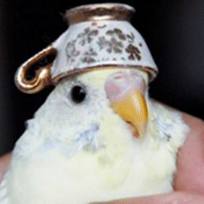

# Image Noise Interpolation

This repository contains the replication of the color image noise interpolation methods outlined by [this paper](https://ieeexplore.ieee.org/document/4145338). See [documentation](https://alvii147.github.io/ImageNoiseInterpolation/build/html/index.html) for more details.

## Installation

Clone the repository,

```bash
git clone https://github.com/alvii147/ImageNoiseInterpolation.git
```

Set up and activate Python virtual environment (optional),

```bash
python3 -m venv env
# Linux/MacOS
source env/bin/activate
# Windows
source env/Scripts/activate
```

Install dependencies,

```bash
pip3 install -r requirements
```

## Demo

**Original Image**



**Noisy Image**


**Interpolated Image**

