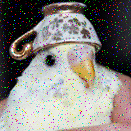

# Image Noise Interpolation

This repository contains the replication of the color image noise interpolation methods to correct impulsive noise, outlined in [this paper](https://ieeexplore.ieee.org/document/1595367). See [documentation](https://alvii147.github.io/ImageNoiseInterpolation/build/html/index.html) for more details, see [report](https://alvii147.github.io/ImageNoiseInterpolation/report/report.html) for walkthrough.

## Installation

Clone the repository,

```bash
git clone https://github.com/alvii147/ImageNoiseInterpolation.git
```

Navigate to cloned directory,

```bash
cd ImageNoiseInterpolation/
```

Set up and activate Python virtual environment (optional),

```bash
python3 -m venv env
# Linux/MacOS
source env/bin/activate
# Windows
source env/Scripts/activate
```

Install dependencies,

```bash
pip3 install -r requirements.txt
```

## Quickstart

### Original Image


### Noisy Image

```bash
python3 noisify.py birb.png birb_noisy.png -p 0.02 -n 0.02
```



### Interpolated Image

```bash
python3 interpolate.py birb_noisy.png birb_interpolated.png
```


