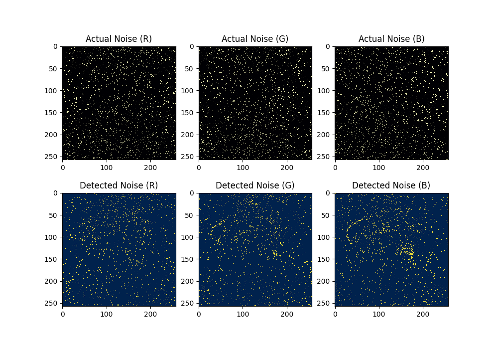

<h1 style="color: #8100B4; text-align: center;">ECE 313&nbsp;&nbsp;•&nbsp;&nbsp;Course Project</h1>

*Student Names:*  **Chung Yu**, **Zahin Zaman**
*Course ID:*  **ECE 313**
*Course Title:*  **Digital Signal Processing**
*Term:*  **Fall**
*Year:*  **2021**
*Department:*  **Electrical & Computer Engineering**
*Faculty:*  **Engineering**
*Institution:*  **University of Waterloo**

<h2>Table of Contents</h2>

[toc]

## Problem

### Problem Statement

Impulse noise is described as the category of noise that is undesired and of relatively short duration, often caused by switching noise or adverse channel environments in communication. Images are often significantly damaged by impulse noise, even if the corruption rate is low. Therefore, there is a need for an efficient image processing method that can be used to filter pixels in an image corrupted by impulsive noise and restore the original pixels (or at least synthesize an appropriate replacement pixel).

This report presents an efficient solution by reproducing the methods of research paper titled [Impulsive Noise Removal Using Interpolation Technique in Color Images](https://ieeexplore.ieee.org/document/1595367)[<sup>[1]</sup>](#references), authored by professors [Yasuhide Wakabayashi](https://ieeexplore.ieee.org/author/37295134000) and [Akira Taguchi](https://ieeexplore.ieee.org/author/38529147300) of the Musashi Institute of Technology's Department of Electrical and Electronic Engineering.

### Other Solutions

The most go-to solution for the removal of impulsive noise is median filtering, which involves replacing every pixel with the median of its surrounding window of pixels. This method is very effective in removing noise in images. However, the downside to this method is the loss of edges and texture of the image. The methods outlined in this report are claimed to reduce noise significantly in images while also preserving edges and details.

## Solution

The methods described in the referenced paper involve two steps: impulsive noise detection and noise interpolation. In the first step, the noisy pixels are detected using an appropriate threshold, after which, only those noisy pixels are replaced using interpolation in the second step. This way, pixels that are unlikely to have been corrupted are not altered.

The entire method is performed parallelly on the red, green and blue channels separately. While the 3 channels are first extracted and split from the image, there exists a correlation between these channels, which is why all 3 of them are used to determine values of interpolated pixels for each of them.

### Impulsive Noise Detection

We start by defining a noisy pixel. A noisy color channel pixel, $x_k(i, j)$ can be given by:
$$
\large x_k(i, j) = \begin{cases}
s_k(i, j), & 1 - p_1 - p_2 \\[5pt]
255, & p_1 \\[5pt]
0, & p_2
\end{cases}
$$
where $k = \{R, G, B\}$, $s_k(i, j)$ is the original, uncorrupted pixel, and $p_1$ and $p_2$ are probabilities of the pixel being positive impulse noise and negative impulse noise respectively.

Detection of this noise can be done by sliding a window of size $N \times N$ across the pixels and computing the following:
$$
\Large | x_k(i, j) - x_k^{MED}(i, j) | \gt \varepsilon
$$
where $x_k^{MED}(i, j)$ is the median pixel value within the $N \times N$ window and $\varepsilon$ is a given threshold value. If this condition is fulfilled for a pixel, it is labelled "noisy".

> :hourglass: **Intuition**
> The logic behind this computation is that a pixel that is not impulsive noise is likely to follow the trend of its surrounding pixels. On the other hand a noisy pixel is more likely to be an outlier when compared with its surrounding pixels. Using median instead of mean guarantees that one extremely bad pixel does not affect the detection of noise since the median is likely to remain the same.

The value of $\varepsilon$ is calculated as follows:
$$
\Large \varepsilon = \begin{cases}
\varepsilon_1, & \bar{x}_k^{MED}(i, j) \gt I_{max} \:\: \text{or} \:\: \bar{x}_k^{MED}(i, j) \lt I_{min} \\[5pt]
\varepsilon_2, & \:\: \text{otherwise}
\end{cases}
$$
where $\bar{x}_k^{MED}(i, j)$ is the average value of $x_k^{MED}(i, j)$ for $k = \{R, G, B\}$. The simulated values of the rest of the parameters are outlined below as claimed by the research paper:

Parameter | Value
--- | ---
$\varepsilon_1$ | $53$
$\varepsilon_2$ | $25$
$I_{min}$ | $50$
$I_{max}$ | $205$

### Noise Interpolation

Once we have identified noisy pixels, we perform the interpolation method outlined in the research paper. This process involves sliding a $3 \times 3$ sized window across the pixels and computing the following values:
$$
\Large \hat{C}[4] = \frac{C[k] + C[l]}{2} + \frac{-A_i[k] + 2A_i[4] - A_i[l]}{2}
$$
where $(k,\:l)$ take values of $\{(0, 8),\:(1, 7),\:(2, 6),\:(3, 5)\}$ and $i$ takes values of $1,\:2$. $C$ is $3 \times 3$ window of the channel that is undergoing interpolation, while $A_1$ and $A_2$ are $3 \times 3$ windows of the other two channels.

> :hourglass: **Intuition**
> For most images that we use, there is correlation between its RGB channels. The values of the same pixels in each of the three channels are related to each other. For this exact reason, this method uses all three channels for the determination of pixel values for one channel.

The indices of $C$ and $A_i$ are defined as follows:


Taking all combinations of $(k, l)$ and $i$ will give us $8$ candidates for $\hat{C}[4]$:

$k$ | $l$ | $i$
--- | --- | ---
0 | 8 | 1
1 | 7 | 1
2 | 6 | 1
3 | 5 | 1
0 | 8 | 2
1 | 7 | 2
2 | 6 | 2
3 | 5 | 2

We then initiate the process of determining the right candidate of $\hat{C}[4]$ to replace $C[4]$ in the $C$ channel array. We start by looking at which terms in our equation for $\hat{C}[4]$ have been labelled as noisy from our noise detection procedure. If a pixel has been labelled noisy, we discard all candidates that use that pixel.

For example, if our noise detection process reveals that $C[1]$ is a noisy pixel, we remove all candidates of $\hat{C}[4]$ that use $C[1]$, i.e. the second and third-last rows of the table.

If this process yields only one candidate that does not use a noisy pixel for its computation, that is the candidate we use to replace $C[4]$.

If this process yields more than one qualifying candidates, we compute the deference value $\hat{C}_{def}[4]$, given by the following formula:
$$
\Large \hat{C}_{def}[4] = \abs{\abs{C[k] - C[l]} - \abs{A_i[k] - A_i[l]}}
$$
Once we compute this for all qualifying candidates, we choose the candidate that has the lowest value of $\hat{C}_{def}[4]$ to replace the $C[4]$ pixel.

If the process of disqualifying candidates that use noisy pixels for computation yields no candidate, we repeat the procedure described above while disregarding the affect of $A_i$. That is, we repeat the process again by computing the following:
$$
\Large \hat{C}[4] = \frac{C[k] + C[l]}{2} \\[10pt]
\Large \hat{C}_{def}[4] = \abs{C[k] - C[l]}
$$

> :scroll: **Note**
> There are 4 possible candidates in this case.

If the repetition of this procedure does not yield any qualifying candidates, then we set the median of $C$ as a replacement for $C[4]$.

## Implementation

The implementation of this method has been written in [Python](https://www.python.org/) using libraries [NumPy](https://numpy.org/) for numerical computation and [Pillow](https://python-pillow.org/) for image processing. All source code can be found in the [Github repository](https://github.com/alvii147/ImageNoiseInterpolation). See [Appendix A](#appendix-a:-installation-instructions) for installation instructions and see [Appendix B](#appendix-b:-source-code-documentation) for source code documentation.

### Noise Generation

We start by importing our required functions.

```python
import numpy as np
import matplotlib.pyplot as plt

from utils import (
    openImage,
    splitChannels,
    addNoise,
    detectNoise,
    interpolateChannel,
    combineChannels,
)
```

Now we open the image `birb.png`[<sup>[2]</sup>](#references) and split it into RGB channels. We can use the `openImage` function to open and read the image file into a multi-dimensional array, and the `splitChannels` function to split the array into its RGB channel arrays.

```python
img = openImage('birb.png')
R, G, B = splitChannels(img)
```

For visualization, we create empty channel `Z` and combine that with the RGB channels to produce images with only one of each of the RGB channels. The `combineChannels` function can be used to combine three channels into an image array.

```python
R, G, B = splitChannels(img)
Z = np.zeros(R.shape, dtype=np.uint8)

R_img = combineChannels(R, Z, Z)
B_img = combineChannels(Z, G, Z)
G_img = combineChannels(Z, Z, B)
```

Now we can use these to visualize the original image, as well as each individual channel. We use `matplotlib` for visualization.

```python
fig, axis = plt.subplots(2, 2)
fig.set_figheight(7)
fig.set_figwidth(7)

axis[0, 0].imshow(img, interpolation='nearest')
axis[0, 0].set_title('Original Image')

axis[0, 1].imshow(R_img, interpolation='nearest')
axis[0, 1].set_title('Channel R')

axis[1, 0].imshow(B_img, interpolation='nearest')
axis[1, 0].set_title('Channel R')

axis[1, 1].imshow(G_img, interpolation='nearest')
axis[1, 1].set_title('Channel B')

plt.show()
```


Now we are to add impulsive noise to each of these channels. We can do that using the `addNoise` function.

> :scroll: **Note**
> This function requires the setting of probabilities `p1` and `p2`, which we can set to `0.02` each. This means there is `0.02` probability of a pixel being converted to positive impulse noise, `0.02` probability of a pixel being converted to negative impulse noise, and `0.96` probability of a pixel not being converted to noise. 
>
> While this seems like a low probability, it is noteworthy that this is applied to all three channels. Thus, the probability of a single pixel in the image being converted to noise is roughly `0.1153` (`0.04 + 0.96x0.04 + 0.96x0.96x0.04`).

We can combine those channels into individual images.

```python
p1 = 0.02
p2 = 0.02

R_noisy, is_noisy_R = addNoise(R, p1=p1, p2=p2)
G_noisy, is_noisy_G = addNoise(G, p1=p1, p2=p2)
B_noisy, is_noisy_B = addNoise(B, p1=p1, p2=p2)

noisy_img = combineChannels(R_noisy, G_noisy, B_noisy)
R_noisy_img = combineChannels(R_noisy, Z, Z)
G_noisy_img = combineChannels(Z, G_noisy, Z)
B_noisy_img = combineChannels(Z, Z, B_noisy)
```

We can then visualize the image and channels with the added noise.

```python
fig, axis = plt.subplots(2, 2)
fig.set_figheight(7)
fig.set_figwidth(7)

axis[0, 0].imshow(noisy_img, interpolation='nearest')
axis[0, 0].set_title('Impulsive Noise')

axis[0, 1].imshow(R_noisy_img, interpolation='nearest')
axis[0, 1].set_title('Impulsive Noise (R)')

axis[1, 0].imshow(G_noisy_img, interpolation='nearest')
axis[1, 0].set_title('Impulsive Noise (G)')

axis[1, 1].imshow(B_noisy_img, interpolation='nearest')
axis[1, 1].set_title('Impulsive Noise (B)')

plt.show()
```


Thus we can see that the image and the channels have been corrupted with impulsive noise.

Next we are to detect this noise.

### Noise Detection

The noise detection algorithm can be implemented using the `detectNoise` function.

```python
detected_noise_R = detectNoise(C=R_noisy, A1=G_noisy, A2=B_noisy)
detected_noise_G = detectNoise(C=G_noisy, A1=R_noisy, A2=B_noisy)
detected_noise_B = detectNoise(C=B_noisy, A1=R_noisy, A2=G_noisy)
```

> :scroll: **Note**
> This function takes in all three channels as parameters because the determination of threshold $\varepsilon$ requires sliding median values from the other channels.

We then visualize the detected noise and compare with the actual noise generated earlier using color maps.

```python
fig, axis = plt.subplots(2, 3)
fig.set_figheight(7)
fig.set_figwidth(10)

axis[0, 0].imshow(is_noisy_R, cmap='magma', interpolation='nearest')
axis[0, 0].set_title('Actual Noise (R)')

axis[0, 1].imshow(is_noisy_G, cmap='magma', interpolation='nearest')
axis[0, 1].set_title('Actual Noise (G)')

axis[0, 2].imshow(is_noisy_B, cmap='magma', interpolation='nearest')
axis[0, 2].set_title('Actual Noise (B)')

axis[1, 0].imshow(detected_noise_R, cmap='cividis', interpolation='nearest')
axis[1, 0].set_title('Detected Noise (R)')

axis[1, 1].imshow(detected_noise_G, cmap='cividis', interpolation='nearest')
axis[1, 1].set_title('Detected Noise (G)')

axis[1, 2].imshow(detected_noise_B, cmap='cividis', interpolation='nearest')
axis[1, 2].set_title('Detected Noise (B)')

plt.show()
```



As we can see, most of the pixels detected as noise in the bottom color maps correspond to a noisy pixel in the top color maps. This shows that our noise detection method has been fairly successful in determining noisy pixels.

The final step is to interpolate these pixels to restore their original values.

### Interpolation

Using the `interpolateChannel` function, we can interpolate the noisy channels, passing all three channels and their detected noise arrays as parameters.

```python
R_interpolated = interpolateChannel(
    R_noisy,
    G_noisy,
    B_noisy,
    detected_noise_R,
    detected_noise_G,
    detected_noise_B,
)

G_interpolated = interpolateChannel(
    G_noisy,
    R_noisy,
    B_noisy,
    detected_noise_G,
    detected_noise_R,
    detected_noise_B,
)

B_interpolated = interpolateChannel(
    B_noisy,
    R_noisy,
    G_noisy,
    detected_noise_B,
    detected_noise_R,
    detected_noise_G,
)
```

This produces channels with the noise-detected pixels interpolated using the algorithms outlined in the referenced research paper. We can combine these pixels to an image for visualization.

```python
interpolated_img = combineChannels(
    R_interpolated,
    G_interpolated,
    B_interpolated,
)

Z = np.zeros(R_interpolated.shape, dtype=np.uint8)
R_interpolated_img = combineChannels(R_interpolated, Z, Z)
G_interpolated_img = combineChannels(Z, G_interpolated, Z)
B_interpolated_img = combineChannels(Z, Z, B_interpolated)
```

We can then visualize the interpolated images.

```python
fig, axis = plt.subplots(1, 4)
fig.set_figheight(3)
fig.set_figwidth(12)

axis[0].imshow(interpolated_img, interpolation='nearest')
axis[0].set_title('Interpolated')

axis[1].imshow(R_interpolated_img, interpolation='nearest')
axis[1].set_title('Interpolated (R)')

axis[2].imshow(G_interpolated_img, interpolation='nearest')
axis[2].set_title('Interpolated (G)')

axis[3].imshow(B_interpolated_img, interpolation='nearest')
axis[3].set_title('Interpolated (B)')

plt.show()
```


As we can see, most of the noisy pixels have been interpolated to restore the original pixels. We can visualize the noisy and interpolated images together for better comparison.

```python
fig, axis = plt.subplots(1, 2)
fig.set_figheight(6)
fig.set_figwidth(12)

axis[0].imshow(noisy_img, interpolation='nearest')
axis[0].set_title('Impulsive Noise')

axis[1].imshow(interpolated_img, interpolation='nearest')
axis[1].set_title('Interpolated')

plt.show()
```


While most of the noisy pixels have been corrected, very few still remain. This is the trade-off for maintaining the same quality of the image.

## Conclusion

### Performance

In order to quantify the results and assess performance, we can compute the normalized mean-squared errors between the original channels, noisy channels and the interpolated channels.

```python
print('NMSE(Original, Noisy) [R]\t\t',
    normalizedMeanSquaredError(
        R,
        R_noisy,
    )
)
print('NMSE(Original, Noisy) [G]\t\t',
    normalizedMeanSquaredError(
        G,
        G_noisy,
    )
)
print('NMSE(Original, Noisy) [B]\t\t',
    normalizedMeanSquaredError(
        B,
        B_noisy,
    )
)
print('\nNMSE(Original, Interpolated) [R]\t',
    normalizedMeanSquaredError(
        R[1 : -1, 1 : -1],
        R_interpolated,
    )
)
print('NMSE(Original, Interpolated) [G]\t',
    normalizedMeanSquaredError(
        G[1 : -1, 1 : -1],
        G_interpolated,
    )
)
print('NMSE(Original, Interpolated) [B]\t',
    normalizedMeanSquaredError(
        B[1 : -1, 1 : -1],
        B_interpolated,
    )
)
```

```
NMSE(Original, Noisy) [R]                0.19376270094887044
NMSE(Original, Noisy) [G]                0.19961825794858304
NMSE(Original, Noisy) [B]                0.19813878006288105

NMSE(Original, Interpolated) [R]         0.04013685593453567
NMSE(Original, Interpolated) [G]         0.03881058949668718
NMSE(Original, Interpolated) [B]         0.04334819242833788
```

> :scroll: **Note**
> When computing normalized mean-squared error between the original and interpolated pixels, it is notable that the original channel has been sliced by applying index `[1 : -1, 1 : -1]`. This crops the image out of one layer of outer pixels. This is done because applying interpolation on an `N x M` sized image returns an interpolated image of size `N - 1 x M - 1`, since our `3 x 3` window neglects the outer layer of the image.

As we can see, the normalized mean-squared error was significantly reduced by this method. The edges and detail of the image have been, however, preserved. We can thus conclude that this method is efficient and effective in removing impulsive noise.

### Limitations

It is, however, important to remember the context of these results. The noise used in this report was salt and pepper noise, which involves noise that is sharp, and either very high or very low in value. If an image is affected by noise that can vary between a large range of values, this method may not be appropriate. Additionally, this method is based on the assumption of correlation between the RGB channels of an image. If no such correlation exists for an image, this method will likely not perform well.

## Appendices

### Appendix A: Installation Instructions

:one: Install **Python** fromhttps://www.python.org/. Most versions will work but version 3.6 or higher is recommended.

:two: Clone the repository and navigate into repository directory.

```bash
git clone https://github.com/alvii147/ImageNoiseInterpolation.git
cd ImageNoiseInterpolation
```

:three: Create and activate a Python **virtual environment** (optional).

```bash
python3 -m venv env
# Linux/MacOS
source env/bin/activate
# Windows
source env/Scripts/activate
```

:four: Install Python library dependencies.

```bash
pip3 install -r requirements.txt
```

:five: Install visualization dependencies (needed for following along with visualization of results on the report, not for usage).

```bash
pip3 install -r docs/report/report_requirements.txt
```

### Appendix B: Source Code Documentation

<span style="font-family: monospace; font-weight: bold;"><span style="color: blue;">utils.</span><span style="font-size: 15pt;"><span style="color: orange;">meanSquaredError</span>(<span style="color: darkblue;">x_actual</span>, <span style="color: darkblue;">x_estimated</span>)</span></span>
Perform mean-squared error.

**Parameters**

- **x_actual** (*numpy.ndarray*) – Actual array.
- **x_estimated** (*numpy.ndarray*) – Estimated array.

**Returns**

- Mean-squared error value.

**Return type**

- float

**Notes**

Mean-squared error is computed using the following formula:
$$
\Large MSE(x_{actual}, x_{estimated}) = \frac{1}{N} \sum\limits_i (x_{actual} - x_{estimated})^2
$$

---

<span style="font-family: monospace; font-weight: bold;"><span style="color: blue;">utils.</span><span style="font-size: 15pt;"><span style="color: orange;">normalizedMeanSquaredError</span>(<span style="color: darkblue;">x_actual</span>, <span style="color: darkblue;">x_estimated</span>)</span></span>
Perform normalized mean-squared error.

**Parameters**

- **x_actual** (*numpy.ndarray*) – Actual array.
- **x_estimated** (*numpy.ndarray*) – Estimated array.

**Returns**

- Normalized mean-squared error value.

**Return type**

- float

**Notes**

Mean-squared error is computed using the following formula:
$$
\Large NMSE(x_{actual}, x_{estimated}) = \frac{MSE(x_{actual}, x_{estimated})}{NMSE(x_{actual}, 0)}
$$

---

<span style="font-family: monospace; font-weight: bold;"><span style="color: blue;">utils.</span><span style="font-size: 15pt;"><span style="color: orange;">openImage</span>(<span style="color: darkblue;">path</span>)</span></span>
Open image from given `path` and split into RGB channels.

**Parameters**

- **path** (*str*) – Path to file as a string, `pathlib.Path` or file object.

**Returns**

- 3-dimensional image array of shape `(H, W, 3)` where `H` and `W` are the height and width of the image respectively.

**Return type**

- numpy.ndarray

---

<span style="font-family: monospace; font-weight: bold;"><span style="color: blue;">utils.</span><span style="font-size: 15pt;"><span style="color: orange;">saveImage</span>(<span style="color: darkblue;">img</span>, <span style="color: darkblue;">path</span>)</span></span>
Save image at given `path` and split into RGB channels.

**Parameters**

- **img** (*numpy.ndarray*) – 3-dimensional image array.
- **path** (*str*) – Path to file as a string, `pathlib.Path` or file object.

---

<span style="font-family: monospace; font-weight: bold;"><span style="color: blue;">utils.</span><span style="font-size: 15pt;"><span style="color: orange;">splitChannels</span>(<span style="color: darkblue;">img</span>)</span></span>
Split image array into R, G, B arrays.

**Parameters**

- **img** (*numpy.ndarray*) – 3-dimensional image array.

**Returns**

- **R** (*numpy.ndarray*) – 2-dimensional red channel array.
- **G** (*numpy.ndarray*) – 2-dimensional green channel array.
- **B** (*numpy.ndarray*) – 2-dimensional blue channel array.

---

<span style="font-family: monospace; font-weight: bold;"><span style="color: blue;">utils.</span><span style="font-size: 15pt;"><span style="color: orange;">combineChannels</span>(<span style="color: darkblue;">R</span>, <span style="color: darkblue;">G</span>, <span style="color: darkblue;">B</span>)</span></span>
Combine R, G, B arrays into image array.

**Parameters**

- **R** (*numpy.ndarray*) – 2-dimensional red channel array.
- **G** (*numpy.ndarray*) – 2-dimensional green channel array.
- **B** (*numpy.ndarray*) – 2-dimensional blue channel array.

**Returns**

- 3-dimensional image array.

**Return type**

- numpy.ndarray

---

<span style="font-family: monospace; font-weight: bold;"><span style="color: blue;">utils.</span><span style="font-size: 15pt;"><span style="color: orange;">addNoise</span>(<span style="color: darkblue;">channel</span>, <span style="color: darkblue;">p1</span>=<span style="color: red;">0.02</span>, <span style="color: darkblue;">p2</span>=<span style="color: red;">0.02</span>, <span style="color: darkblue;">is_noisy</span>=<span style="color: red;">None</span>)</span></span>
Add randomized noise to channel.

**Parameters**

- **channel** (*numpy.ndarray*) – 2-dimensional channel array.
- **p1** (*float**,* *optional*) – Probability of a pixel being converted to positive impulse noise, should be in the range `[0, 1)`.
- **p2** (*float**,* *optional*) – Probability of a pixel being converted to negative impulse noise, should be in the range `[0, 1)`.
- **is_noisy** (*numpy.ndarray**,* *optional*) – 2-dimensional boolean array indicating which pixels should be converted to noise. If not provided, this is randomized.

**Returns**

- **noisy_channel** (*numpy.ndarray*) – Channel with randomized noise added.
- **is_noisy** (*numpy.ndarray*) – Boolean array of same shape as `channel`, indicating which pixels have been converted to noise.

**Notes**

This is an implementation of salt and pepper noise. A color channel pixel $x_k(i, j)$ corrupted by impulsive noise is given by:
$$
\Large x_k(i, j) = \begin{cases}
s_k(i, j), & 1 - p_1 - p_2 \\[5pt]
255, & p_1 \\[5pt]
0, & p_2
\end{cases}
$$
where $s_k(i, j)$ is the original noiseless pixel and $p_1$ and $p_2$ are probabilities of a pixel being positive and negative impulsive noise respectively.

---

<span style="font-family: monospace; font-weight: bold;"><span style="color: blue;">utils.</span><span style="font-size: 15pt;"><span style="color: orange;">slidingWindowOperation</span>(<span style="color: darkblue;">channel</span>, <span style="color: darkblue;">window_shape</span>, <span style="color: darkblue;">op</span>=<span style="color: red;">'mean'</span>)</span></span>
Perform operation on sliding window over channel.

**Parameters**

- **channel** (*numpy.ndarray*) – 2-dimensional channel array.
- **window_shape** (*int* *or* *numpy.ndarray*) – Integer or array indicating shape of window. Window is `(N, N)` square if given integer `N`, `(N, M)` rectangular if given array `[N, M]`.
- **op** (*str* *or* *callable function**,* *optional*) – Operation to perform on each window. It an be set to `'mean'` or `'median'` for mean and median operations respectively.

**Returns**

- Output array of size `(H - N + 1, W - M + 1)`, where `H` and `W` are the height and width of the image respectively.

**Return type**

- numpy.ndarray

---

<span style="font-family: monospace; font-weight: bold;"><span style="color: blue;">utils.</span><span style="font-size: 15pt;"><span style="color: orange;">getThreshold</span>(<span style="color: darkblue;">mean_of_median</span>, <span style="color: darkblue;">E1</span>, <span style="color: darkblue;">E2</span>, <span style="color: darkblue;">Imin</span>, <span style="color: darkblue;">Imax</span>)</span></span>
Compute threshold value for noise detection.

**Parameters**

- **mean_of_median** (*float*) – Average value of medians of `NxN` windows of all three channels.
- **E1** (*int*) – Noise threshold value 1.
- **E2** (*int*) – Noise threshold value 2.
- **Imin** (*int*) – Minumum threshold for mean of median.
- **Imax** (*int*) – Maximum threshold for mean of median.

**Returns**

- Noise threshold value to be used to detect noise.

**Return type**

- int

**Notes**

`E` is calculated using the following formula:
$$
\Large \varepsilon = \begin{cases}
\varepsilon_1, & \bar{x}_k^{MED}(i, j) \gt I_{max} \:\:
\text{or} \:\: \bar{x}_k^{MED}(i, j) \lt I_{min} \\[5pt]
\varepsilon_2, & \:\: \text{otherwise}
\end{cases}
$$
where $\bar{x}_k^{MED}(i, j)$ is the average value of medians in all three channel windows.

---

<span style="font-family: monospace; font-weight: bold;"><span style="color: blue;">utils.</span><span style="font-size: 15pt;"><span style="color: orange;">detectNoise</span>(<span style="color: darkblue;">C</span>, <span style="color: darkblue;">A1</span>, <span style="color: darkblue;">A2</span>, <span style="color: darkblue;">N</span>=<span style="color: red;">3</span>, <span style="color: darkblue;">E1</span>=<span style="color: red;">53</span>, <span style="color: darkblue;">E2</span>=<span style="color: red;">25</span>, <span style="color: darkblue;">Imin</span>=<span style="color: red;">50</span>, <span style="color: darkblue;">Imax</span>=<span style="color: red;">205</span>)</span></span>
Identify noisy pixels in channel array.

**Parameters**

- **C** (*numpy.ndarray*) – Primary channel array window.
- **A1** (*numpy.ndarray*) – Secondary channel array 1 window.
- **A2** (*numpy.ndarray*) – Secondary channel array 2 window.
- **N** (*int*) – Window length. Must be odd.
- **E1** (*int*) – Noise threshold value 1.
- **E2** (*int*) – Noise threshold value 2.
- **Imin** (*int*) – Minumum threshold for mean of median.
- **Imax** (*int*) – Maximum threshold for mean of median.

**Returns**

- Boolean array of same shape as `channel`, indicating which pixels are noisy.

**Return type**

- numpy.ndarray

**Notes**

Noise is detected by comparing each pixel in given channel `C` to median of `NxN` window surrounding the pixel. A pixel $x_k(i, j)$ is labelled noise if it satisfies the following condition:
$$
\Large |x_k(i, j) - x_k^{MED}(i, j)| \gt \varepsilon
$$
where $x_k^{MED}(i, j)$ is the median within the `NxN` window and $\varepsilon$ is threshold, `E`, which is calculated using `E1`, `E2`, `Imin` and `Imax`. For more information, see `getThreshold`.

---

<span style="font-family: monospace; font-weight: bold;"><span style="color: blue;">utils.</span><span style="font-size: 15pt;"><span style="color: orange;">getCandidate</span>(<span style="color: darkblue;">C</span>, <span style="color: darkblue;">A</span>, <span style="color: darkblue;">idx</span>)</span></span>
Calculate candidate for interpolated pixel using given indices.

**Parameters**

- **C** (*numpy.ndarray*) – Primary channel array window.
- **A** (*numpy.ndarray*) – Secondary channel array window.
- **idx** (*(**int**,* *int**)*) – Indices to use for computation.

**Returns**

- **candidate_C** (*int*) – Candidate for interpolated pixel using primary channel window.
- **candidate_CA** (*int*) – Candidate for interpolated pixel using primary and secondary channel windows.

**Notes**

Candidates are calculated using the following computations:
$$
\Large \begin{align*}
\hat{C}[4] &= \frac{C[k] + C[l]}{2} \\[5pt]
\hat{C}[4] &= \frac{C[k] + C[l]}{2} + \frac{-A[k] + 2A[4] - A[l]}{2}
\end{align*}
$$
where $C$ and $A$ are flattened versions of `3x3` window arrays, and $k$ and $l$ are given indices.

---

<span style="font-family: monospace; font-weight: bold;"><span style="color: blue;">utils.</span><span style="font-size: 15pt;"><span style="color: orange;">getValidity</span>(<span style="color: darkblue;">is_noisy_C</span>, <span style="color: darkblue;">is_noisy_A</span>, <span style="color: darkblue;">idx</span>)</span></span>
Calculate validity of candidate for interpolated pixel using given indices. Validity is based on the channel's noisy pixels.

**Parameters**

- **is_noisy_C** (*numpy.ndarray*) – Boolean array indicating which pixels of primary channel window array are noisy.
- **is_noisy_A** (*numpy.ndarray*) – Boolean array indicating which pixels of secondary channel window array are noisy.
- **idx** ((*int*, *int*)) – Indices to use for computation.

**Returns**

- **validity_C** (*bool*) – Validity of interpolated pixel using primary channel window.
- **validity_CA** (*bool*) – Validity of interpolated pixel using primary and secondary channel windows.

**Notes**

Validity is evaluated by looking at whether the pixels at the given indices are noisy. If any one of the pixels are noisy, the candidate is considered invalid.

---

<span style="font-family: monospace; font-weight: bold;"><span style="color: blue;">utils.</span><span style="font-size: 15pt;"><span style="color: orange;">getDeference</span>(<span style="color: darkblue;">C</span>, <span style="color: darkblue;">A</span>, <span style="color: darkblue;">idx</span>)</span></span>
Calculate deference of candidate for interpolated pixel using given indices.

**Parameters**

- **C** (*numpy.ndarray*) – Primary channel array window.
- **A** (*numpy.ndarray*) – Secondary channel array window.
- **idx** (*(**int**,* *int**)*) – Indices to use for computation.

**Returns**

- **deference_C** (*int*) – Deference of interpolated pixel using primary channel window.
- **deference_CA** (*int*) – Deference of interpolated pixel using primary and secondary channel windows.

**Notes**

Candidates are calculated using the following computations:
$$
\Large \begin{align*}
\hat{C}_{def}[4] &= \abs{C[k] - C[l]} \\[5pt]
\hat{C}_{def}[4] &= \abs{\abs{C[k] - C[l]} - \abs{A[k] - A[l]}}
\end{align*}
$$
where $C$ and $A$ are flattened versions of `3x3` window arrays, and $k$ and $l$ are given indices.

---

<span style="font-family: monospace; font-weight: bold;"><span style="color: blue;">utils.</span><span style="font-size: 15pt;"><span style="color: orange;">interpolatePixel</span>(<span style="color: darkblue;">C</span>, <span style="color: darkblue;">A1</span>, <span style="color: darkblue;">A2</span>, <span style="color: darkblue;">is_noisy_C</span>, <span style="color: darkblue;">is_noisy_A1</span>, <span style="color: darkblue;">is_noisy_A2</span>)</span></span>
Calculate interpolated pixel for centre pixel of given `3x3` window of channels.

**Parameters**

- **C** (*numpy.ndarray*) – Primary channel array window.
- **A1** (*numpy.ndarray*) – Secondary channel array 1 window.
- **A2** (*numpy.ndarray*) – Secondary channel array 2 window.
- **is_noisy_C** (*numpy.ndarray*) – Boolean array indicating which pixels of primary channel window array are noisy.
- **is_noisy_A1** (*numpy.ndarray*) – Boolean array indicating which pixels of secondary channel window array 1 are noisy.
- **is_noisy_A2** (*numpy.ndarray*) – Boolean array indicating which pixels of secondary channel window array 2 are noisy.

**Returns**

- Interpolated pixel.

**Return type**

- int

---

<span style="font-family: monospace; font-weight: bold;"><span style="color: blue;">utils.</span><span style="font-size: 15pt;"><span style="color: orange;">interpolateChannel</span>(<span style="color: darkblue;">C</span>, <span style="color: darkblue;">A1</span>, <span style="color: darkblue;">A2</span>, <span style="color: darkblue;">is_noisy_C</span>, <span style="color: darkblue;">is_noisy_A1</span>, <span style="color: darkblue;">is_noisy_A2</span>)</span></span>
Interpolate pixels for channel where noisy pixels are present.

**Parameters**

- **C** (*numpy.ndarray*) – Primary channel array.
- **A1** (*numpy.ndarray*) – Secondary channel array 1.
- **A2** (*numpy.ndarray*) – Secondary channel array 2.
- **is_noisy_C** (*numpy.ndarray*) – Boolean array indicating which pixels of primary channel array are noisy.
- **is_noisy_A1** (*numpy.ndarray*) – Boolean array indicating which pixels of secondary channel array 1 are noisy.
- **is_noisy_A2** (*numpy.ndarray*) – Boolean array indicating which pixels of secondary channel array 2 are noisy.

**Returns**

- Interpolated primary channel.

**Return type**

- numpy.ndarray

---

## References

[1] Y. Wakabayashi, A. Taguchi. (2005, December). *Impulsive Noise Removal Using Interpolation Technique in Color Images*. Available https://ieeexplore.ieee.org/document/1595367

[2] Fictspedia Wiki. (2012). *Birb* [Online]. Available https://fictspedia.fandom.com/wiki/Birb
