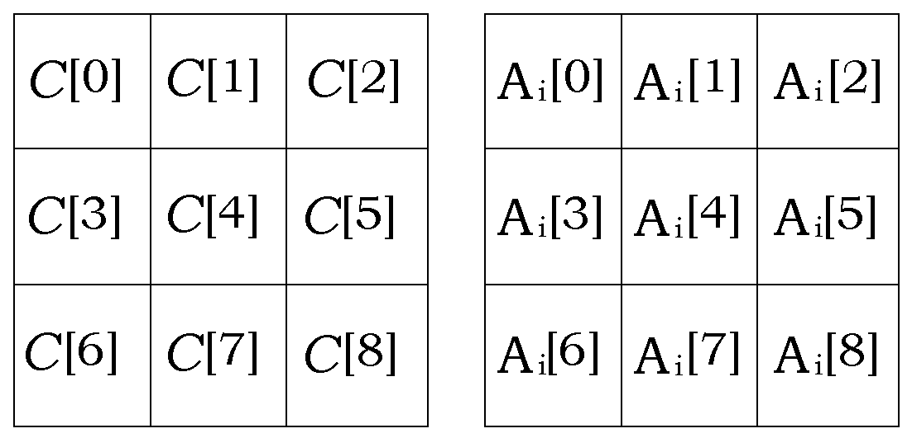
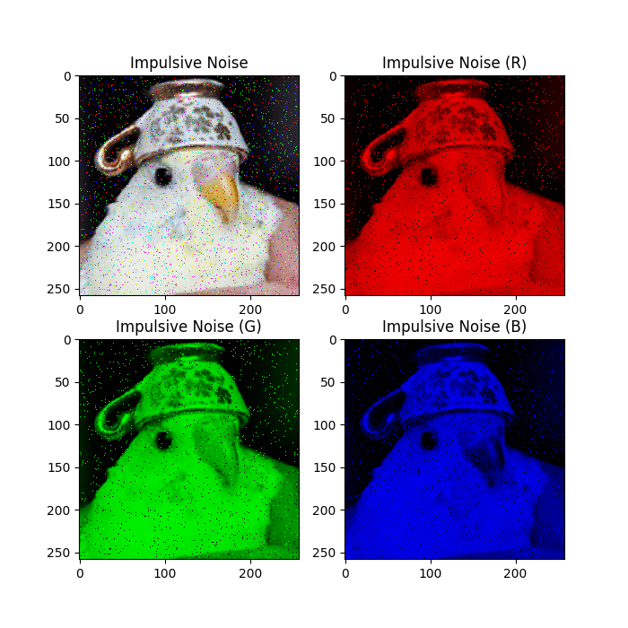

<h1 style="color: #8100B4; text-align: center;">ECE 313&nbsp;&nbsp;•&nbsp;&nbsp;Course Project</h1>

*Student Names:*  **Chung Yu**, **Zahin Zaman**
*Course ID:*  **ECE 313**
*Course Title:*  **Digital Signal Processing**
*Term:*  **Fall**
*Year:*  **2021**
*Department:*  **Electrical & Computer Engineering**
*Faculty:*  **Engineering**
*Institution:*  **University of Waterloo**

<h2>Table of Contents</h2>

[toc]

## Problem

### Problem Statement

Impulse noise is described as the category of noise that is undesired and of relatively short duration, often caused by switching noise or adverse channel environments in communication. Images are often significantly damaged by impulse noise, even if the corruption rate is low. Therefore, there is a need for an efficient image processing method that can be used to filter pixels in an image corrupted by impulsive noise and restore the original pixels (or at least synthesize an appropriate replacement pixel).

This report presents an efficient solution by reproducing the methods of research paper titled [Impulsive Noise Removal Using Interpolation Technique in Color Images](https://ieeexplore.ieee.org/document/1595367), authored by professors [Yasuhide Wakabayashi](https://ieeexplore.ieee.org/author/37295134000) and [Akira Taguchi](https://ieeexplore.ieee.org/author/38529147300) of the Musashi Institute of Technology's Department of Electrical and Electronic Engineering.

### Other Solutions

The most go-to solution for the removal of impulsive noise is median filtering, which involves replacing every pixel with the median of its surrounding window of pixels. This method is very effective in removing noise in images. However, the downside to this method is the loss of edges and texture of the image. The methods outlined in this report are claimed to reduce noise significantly in images while also preserving edges and details.

## Solution

The methods described in the referenced paper involve two steps: impulsive noise detection and noise interpolation. In the first step, the noisy pixels are detected using an appropriate threshold, after which, only those noisy pixels are replaced using interpolation in the second step. This way, pixels that are unlikely to have been corrupted are not altered.

The entire method is performed parallelly on the red, green and blue channels separately. While the 3 channels are first extracted and split from the image, there exists a correlation between these channels, which is why all 3 of them are used to determine values of interpolated pixels for each of them.

### Impulsive Noise Detection

We start by defining a noisy pixel. A noisy color channel pixel, $x_k(i, j)$ can be given by:
$$
\large x_k(i, j) = \begin{cases}
s_k(i, j), & 1 - p_1 - p_2 \\[5pt]
255, & p_1 \\[5pt]
0, & p_2
\end{cases}
$$
where $k = \{R, G, B\}$, $s_k(i, j)$ is the original, uncorrupted pixel, and $p_1$ and $p_2$ are probabilities of the pixel being positive impulse noise and negative impulse noise respectively.

Detection of this noise can be done by sliding a window of size $N \times N$ across the pixels and computing the following:
$$
\Large | x_k(i, j) - x_k^{MED}(i, j) | \gt \varepsilon
$$
where $x_k^{MED}(i, j)$ is the median pixel value within the $N \times N$ window and $\varepsilon$ is a given threshold value. If this condition is fulfilled for a pixel, it is labelled "noisy".

> **Intuition**
> The logic behind this computation is that a pixel that is not impulsive noise is likely to follow the trend of its surrounding pixels. On the other hand a noisy pixel is more likely to be an outlier when compared with its surrounding pixels. Using median instead of mean guarantees that one extremely bad pixel does not affect the detection of noise since the median is likely to remain the same.

The value of $\varepsilon$ is calculated as follows:
$$
\Large \varepsilon = \begin{cases}
\varepsilon_1, & \bar{x}_k^{MED}(i, j) \gt I_{max} \:\: \text{or} \:\: \bar{x}_k^{MED}(i, j) \lt I_{min} \\[5pt]
\varepsilon_2, & \:\: \text{otherwise}
\end{cases}
$$
where $\bar{x}_k^{MED}(i, j)$ is the average value of $x_k^{MED}(i, j)$ for $k = \{R, G, B\}$. The simulated values of the rest of the parameters are outlined below as claimed by the research paper:

Parameter | Value
--- | ---
$\varepsilon_1$ | $53$
$\varepsilon_2$ | $25$
$I_{min}$ | $50$
$I_{max}$ | $205$

### Noise Interpolation

Once we have identified noisy pixels, we perform the interpolation method outlined in the research paper. This process involves sliding a $3 \times 3$ sized window across the pixels and computing the following values:
$$
\Large \hat{C}[4] = \frac{C[k] + C[l]}{2} + \frac{-A_i[k] + 2A_i[4] - A_i[l]}{2}
$$
where $(k,\:l)$ take values of $\{(0, 8),\:(1, 7),\:(2, 6),\:(3, 5)\}$ and $i$ takes values of $1,\:2$. $C$ is $3 \times 3$ window of the channel that is undergoing interpolation, while $A_1$ and $A_2$ are $3 \times 3$ windows of the other two channels.

> **Intuition**
> For most images that we use, there is correlation between its RGB channels. The values of the same pixels in each of the three channels are related to each other. For this exact reason, this method uses all three channels for the determination of pixel values for one channel.

The indices of $C$ and $A_i$ are defined as follows:



Taking all combinations of $(k, l)$ and $i$ will give us $8$ candidates for $\hat{C}[4]$:

$k$ | $l$ | $i$
--- | --- | ---
0 | 8 | 1
1 | 7 | 1
2 | 6 | 1
3 | 5 | 1
0 | 8 | 2
1 | 7 | 2
2 | 6 | 2
3 | 5 | 2

We then initiate the process of determining the right candidate of $\hat{C}[4]$ to replace $C[4]$ in the $C$ channel array. We start by looking at which terms in our equation for $\hat{C}[4]$ have been labelled as noisy from our noise detection procedure. If a pixel has been labelled noisy, we discard all candidates that use that pixel.

For example, if our noise detection process reveals that $C[1]$ is a noisy pixel, we remove all candidates of $\hat{C}[4]$ that use $C[1]$, i.e. the second and third-last rows of the table.

If this process yields only one candidate that does not use a noisy pixel for its computation, that is the candidate we use to replace $C[4]$.

If this process yields more than one qualifying candidates, we compute the deference value $\hat{C}_{def}[4]$, given by the following formula:
$$
\Large \hat{C}_{def}[4] = \abs{\abs{C[k] - C[l]} - \abs{A_i[k] - A_i[l]}}
$$
Once we compute this for all qualifying candidates, we choose the candidate that has the lowest value of $\hat{C}_{def}[4]$ to replace the $C[4]$ pixel.

If the process of disqualifying candidates that use noisy pixels for computation yields no candidate, we repeat the procedure described above while disregarding the affect of $A_i$. That is, we repeat the process again by computing the following:
$$
\Large \hat{C}[4] = \frac{C[k] + C[l]}{2} \\[10pt]
\Large \hat{C}_{def}[4] = \abs{C[k] - C[l]}
$$

> **Note**
> There are 4 possible candidates in this case

If the repetition of this procedure does not yield any qualifying candidates, then we set the median of $C$ as a replacement for $C[4]$.

## Implementation

The implementation of this method has been written in [Python](https://www.python.org/) using libraries [NumPy](https://numpy.org/) for numerical computation and [Pillow](https://python-pillow.org/) for image processing. All source code can be found in the [Github repository](https://github.com/alvii147/ImageNoiseInterpolation).

### Noise Generation

We start by importing our required functions.

```python
import numpy as np
import matplotlib.pyplot as plt

from utils import (
    openImage,
    splitChannels,
    addNoise,
    detectNoise,
    interpolateChannel,
    combineChannels,
)
```

Now we open the image `birb.png` and split it into RGB channels.

```python
img = openImage('birb.png')
R, G, B = splitChannels(img)
```

For visualization, we create empty channel `Z` and combine that with the RGB channels to produce images with only one of each of the RGB channels.

```python
R, G, B = splitChannels(img)
Z = np.zeros(R.shape, dtype=np.uint8)

R_img = combineChannels(R, Z, Z)
B_img = combineChannels(Z, G, Z)
G_img = combineChannels(Z, Z, B)
```

Now we can use these to visualize the original image, as well as each individual channel. We use `matplotlib` for visualization.

```python
fig, axis = plt.subplots(2, 2)
fig.set_figheight(7)
fig.set_figwidth(7)

axis[0, 0].imshow(img, interpolation='nearest')
axis[0, 0].set_title('Original Image')

axis[0, 1].imshow(R_img, interpolation='nearest')
axis[0, 1].set_title('Channel R')

axis[1, 0].imshow(B_img, interpolation='nearest')
axis[1, 0].set_title('Channel R')

axis[1, 1].imshow(G_img, interpolation='nearest')
axis[1, 1].set_title('Channel B')

plt.show()
```


Now we are to add impulsive noise to each of these channels. We can do that using the `addNoise` function.

> **Note**
> This function requires the setting of probabilities `p1` and `p2`, which we can set to `0.02` each. This means there is `0.02` probability of a pixel being converted to positive impulse noise, `0.02` probability of a pixel being converted to negative impulse noise, and `0.96` probability of a pixel not being converted to noise. 
>
> While this seems like a low probability, it is noteworthy that this is applied to all three channels. Thus, the probability of a single pixel in the image being converted to noise is roughly `0.1153` (`0.04 + 0.96x0.04 + 0.96x0.96x0.04`).

We can combine those channels into individual images.

```python
p1 = 0.02
p2 = 0.02

R_noisy, is_noisy_R = addNoise(R, p1=p1, p2=p2)
G_noisy, is_noisy_G = addNoise(G, p1=p1, p2=p2)
B_noisy, is_noisy_B = addNoise(B, p1=p1, p2=p2)

noisy_img = combineChannels(R_noisy, G_noisy, B_noisy)
R_noisy_img = combineChannels(R_noisy, Z, Z)
G_noisy_img = combineChannels(Z, G_noisy, Z)
B_noisy_img = combineChannels(Z, Z, B_noisy)
```

We can visualize the image and channels with the added noise



Thus we can see that the image and the channels have been corrupted with impulsive noise. Next we are to detect this noise.

### Noise Detection

### Interpolation

## Conclusion

## Index